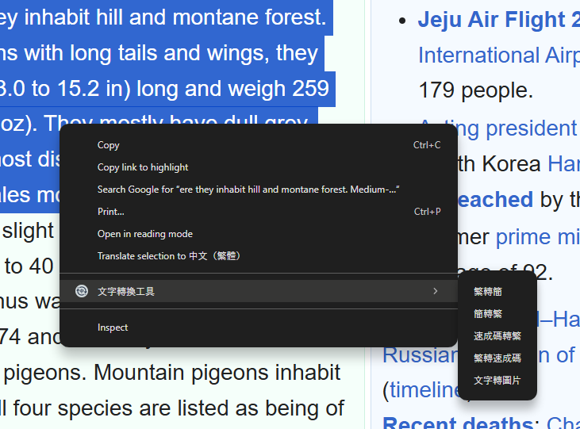

# 文字轉換工具

這工具提供把已選擇部份截圖/繁簡轉換/速成碼轉換的功能,可在跳出視窗/右鍵選單中使用.

* 讓你可以快速截圖/轉換繁簡, 或在你忘記切輸入法時可以立即轉換文字而不需重新輸入. 而且在在跳出視窗可以自定右鍵選單和轉換模式.

* 如果在右鍵選單中使用就會在把結果複製到剪貼簿中, 貼上後就能得到結果, 或者在跳出視窗中進行轉換, 就會在跳出視窗的輸出欄中得到結果.

## 功能

* 右鍵選單 

  

* 跳出視窗 

  

## 下載連結

https://chromewebstore.google.com/detail/%E6%96%87%E5%AD%97%E8%BD%89%E6%8F%9B%E5%B7%A5%E5%85%B7/efdjngbfhfhmambhgcfbnmpggjgfalpg?authuser=5&hl=zh-TW

## Authors

Ken Tang

email: meiskena999@gmail.com

## Version History

* 3
  * Initial Release
  * implement text convert to image in popup
  * implement user selection snapshot in the webpage
* 2
  * implement popup and converter in popup
  * implement store user settings
  * implement convert between quick and chinese
* 1
  * implement convert between zh and cn in context menu

## License

This project is licensed under the MIT License - see the LICENSE.md file for details

## Acknowledgments

The libraries, code snippets i use.

* [html2canvas](https://github.com/niklasvh/html2canvas)
* [opencc-js](https://github.com/nk2028/opencc-js?tab=readme-ov-file)
* [qdict from SuchengCheck](https://github.com/s2031215/SuchengCheck/blob/main/qdict_mini.js)
