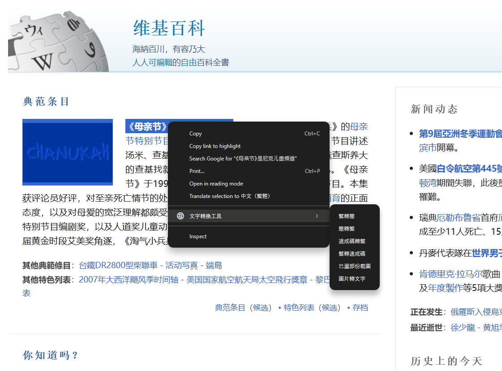
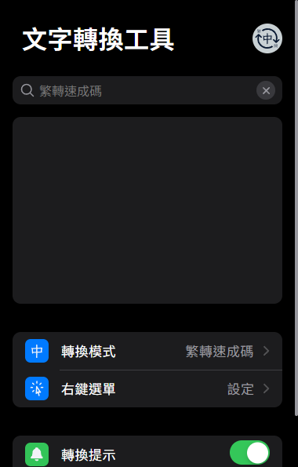
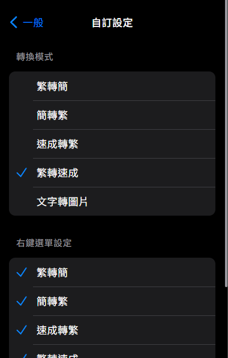

# 文字轉換工具

這工具像是強化複製,用法就像平常複製,先選取文字後再右鍵複製,再貼上得到結果.

* 選取文字後再右鍵就可以使用: 繁簡轉換/ 圖片轉文字/ 已選擇部份截圖/ 速成碼轉換的功能, 這些功能都是把結果複製到剪貼簿中, 所以需要後貼上才會得到結果.
* 還可以在跳出視窗中使用: 繁簡轉換/ 圖片轉文字/ 已選擇部份截圖/ 速成字典的功能.
* 圖片轉文字只要直接右鍵點選圖片就可以使用,先選取多張圖片再使用也可以.
* 可自由更改你右鍵選單中的功能, 關閉所有你不想用的功能. 
* 所有功能都係以離線的方式實現, 所以不會有任何的資料傳輸.

## 功能

* 右鍵選單 

  

* 跳出視窗 

  

## 下載連結

https://chromewebstore.google.com/detail/%E6%96%87%E5%AD%97%E8%BD%89%E6%8F%9B%E5%B7%A5%E5%85%B7/efdjngbfhfhmambhgcfbnmpggjgfalpg?authuser=5&hl=zh-TW

## Authors

Ken Tang

email: meiskena999@gmail.com

## License

This project is licensed under the MIT License - see the LICENSE.md file for details

## Acknowledgments

The libraries, code snippets i use.

* [html2canvas](https://github.com/niklasvh/html2canvas)
* [opencc-js](https://github.com/nk2028/opencc-js?tab=readme-ov-file)
* [qdict from SuchengCheck](https://github.com/s2031215/SuchengCheck/blob/main/qdict_mini.js)
* [tesseract.js](https://github.com/naptha/tesseract.js#tesseractjs)

## Version History

* 4
  * implement image to text
* 3
  * Initial Release
  * implement text convert to image in popup
  * implement user selection snapshot in the webpage
* 2
  * implement popup and converter in popup
  * implement store user settings
  * implement convert between quick and chinese
* 1
  * implement convert between zh and cn in context menu
